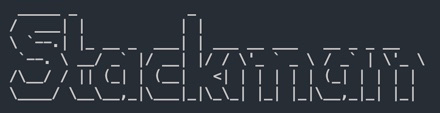

\


Stackman is a simple command line tool that downloads containerized, popular webstacks. 
Templates downloaded from: https://github.com/rcoleworld/stackman-templates


### Must have svn, npm, and docker.
### Supported Stacks
- [X] MERN
- [ ] MEAN
- [ ] MEVN
- [ ] LAMPy


## To install:
```
$ git clone https://github.com/rcoleworld/stackman.git
```
## To setup:
```
$ vim ~/.bashrc
```
## or
```
$ vim ~/.zshrc
```
## Add this to the .rc file:
```
source "filepath"/stackman.sh
```